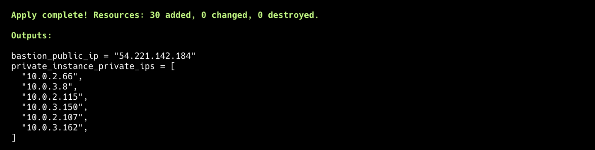
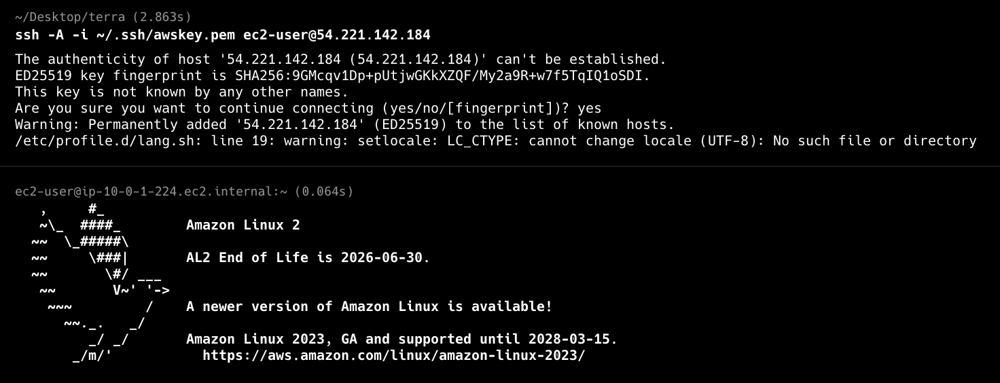
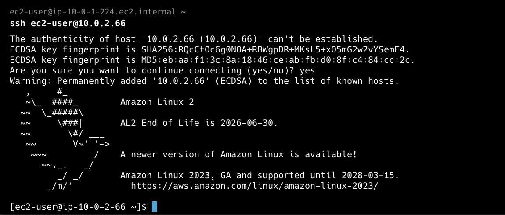

# EC2 Infrastructure Setup with Packer and Terraform

This repository automates the creation of an Amazon Machine Image (AMI) with Docker installed using **Packer**, and then provisions a VPC with EC2 instances using **Terraform**.

---

## 📦 What This Sets Up

1. **Custom AMI (Amazon Linux 2)**  
   - Created via Packer  
   - Installs and enables Docker

2. **VPC and Networking (via Terraform Modules)**  
   - 1 VPC with public and private subnets across 2 AZs  
   - NAT Gateway for internet access from private subnets

3. **Security Groups**  
   - Bastion host SG allows SSH from your IP  
   - Private instance SG allows SSH from Bastion only

4. **EC2 Instances**  
   - **1 Bastion Host** (public subnet, SSH access from your IP)  
   - **6 Private EC2 Instances** (private subnets, accessible via Bastion)  
   - All use the Docker-enabled AMI built with Packer

---

## 🚀 Setup Instructions

### 1. Clone the Repository

```bash
git clone <your-repo-url>
cd <repo>
```

### 2. Export Required Packer Variables

```bash
export SSH_KEY_NAME=awskey
export SSH_KEY_PATH=~/.ssh/awskey.pem

export PACKER_VAR_ssh_keypair_name=$SSH_KEY_NAME
export PACKER_VAR_ssh_private_key_file=$SSH_KEY_PATH
```

> **Make sure you have a key registered within AWS and change this to match your key name and path!**

### 3. Run the Setup Script

```bash
chmod +x ./up.sh
./up.sh
```
**Terraform Created!**


What this does:
- Builds a Docker-ready AMI using Packer
- Extracts the AMI ID into `ami_id.txt`
- Sets your IP for SSH access (`TF_VAR_my_ip`)
- Initializes and applies Terraform to provision:
  - VPC
  - Bastion host
  - 6 private EC2 instances
- Cleans up temporary files

---

## 🔐 SSH Access: Bastion and Private EC2

To connect to your private EC2 instances through the Bastion host using `ssh-agent`:

1. **Start ssh-agent and add your key**:

```bash
eval $(ssh-agent)
ssh-add ~/.ssh/awskey.pem
```

2. **SSH into the Bastion Host**:

```bash
ssh -A ec2-user@<bastion-public-ip>
```

> Replace `<bastion-public-ip>` with the actual IP from your AWS Console.

3. **From the Bastion, SSH into a Private EC2 Instance**:

```bash
ssh ec2-user@<private-ec2-ip>
```

> Replace `<private-ec2-ip>` with the private IP of the instance.

**Bastion Host Login**  


**Private EC2 via Bastion**  


---

## ✅ Prerequisites

- [AWS CLI](https://docs.aws.amazon.com/cli/latest/userguide/install-cliv2.html) configured with appropriate credentials
- [Packer](https://developer.hashicorp.com/packer/install)
- [Terraform](https://developer.hashicorp.com/terraform/install)
- Existing EC2 Key Pair in AWS (`eg. awskey`) or whatever you have.
- SSH private key file locally (`eg. ~/.ssh/awskey.pem`) or whatever your path is.

---

## 🧹 Cleanup

To destroy the infrastructure:

```bash
terraform destroy -auto-approve
```

---
